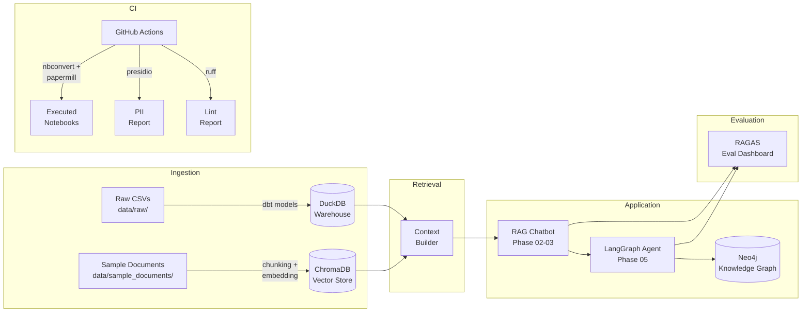

# AI Engineer Learning Curriculum — 28 Weeks to Production AI

**LLM-first · SPK-stack aligned · 100% free tools · Jupyter notebooks throughout**


---

## Quick Start

```bash
# 1. Clone the repo
git clone https://github.com/alexandereismont/ai-engineer.git
cd ai-engineer

# 2. Create and activate a virtual environment
python3.11 -m venv .venv
source .venv/bin/activate        # Windows: .venv\Scripts\activate

# 3. Install all dependencies
pip install -r requirements.txt

# 4. Copy environment template and fill in values
cp .env.example .env

# 5. Install pre-commit hooks
pip install pre-commit
pre-commit install

# 6. Launch Jupyter Lab
jupyter lab
```

Open the phase folder for whichever week you are working on and follow the numbered notebooks in order.

---

## Curriculum Map

| Phase | Weeks | Topic | Build Project |
|-------|-------|-------|---------------|
| 01 | 1–4 | Embeddings & Semantic Similarity | Semantic search engine over pension regulation corpus |
| 02 | 5–9 | LLMs, Prompting & First RAG | Local RAG chatbot (Ollama + ChromaDB) with MCP tool calls |
| 03 | 10–14 | Advanced RAG & Evaluation | Hybrid retriever + RAGAS evaluation dashboard |
| 04 | 15–18 | Data Pipelines & Orchestration | dbt + DuckDB pipeline orchestrated by Prefect |
| 05 | 19–23 | Agents & Knowledge Graphs | LangGraph agent with Neo4j knowledge graph backend |
| 06 | 24–28 | CI/CD, Compliance & Portfolio | GitHub Actions CI, PII detection, portfolio site |

---

## Prerequisites

- **Python 3.11+** — all notebooks and scripts target 3.11; 3.12 is also supported
- **Docker** — required for running Ollama (local LLMs) and Neo4j (knowledge graph); install [Docker Desktop](https://www.docker.com/products/docker-desktop/) or Docker Engine on Linux
- **16 GB RAM minimum** — recommended 32 GB if running larger LLMs (7B+ parameters) locally
- **50 GB free disk space** — for model weights, vector store snapshots, and DuckDB data files
- **Git** with pre-commit hooks configured (see Quick Start above)

### Starting Ollama

```bash
docker run -d -v ollama:/root/.ollama -p 11434:11434 --name ollama ollama/ollama
docker exec -it ollama ollama pull llama3.1:8b
docker exec -it ollama ollama pull nomic-embed-text
```

### Starting Neo4j (Phase 05 only)

```bash
docker run -d \
  --name neo4j \
  -p 7474:7474 -p 7687:7687 \
  -e NEO4J_AUTH=neo4j/your_password_here \
  neo4j:5.24
```

---

## Data Overview

All raw data lives in `data/raw/`. The three CSV files are designed to simulate a real-world pension fund analytics environment, providing realistic domain context for every phase of the curriculum.

| File | Rows | Description |
|------|------|-------------|
| `data/raw/articles.csv` | 500 | Academic and industry articles with titles, abstracts, categories, and publication metadata spanning pension regulation, investment theory, macroeconomics, fintech/AI, actuarial science, and general ML |
| `data/raw/pension_funds.csv` | 200 | Annual snapshots (2020–2024) for 40 fictional European pension funds across NL, DE, BE, FR, and DK — including AUM, coverage ratios, asset allocation, ESG scores, and member counts |
| `data/raw/transactions.csv` | 1,000 | Simulated investment transactions referencing the pension funds above — including counterparty details, ISIN codes, and analyst PII (intentionally included for Phase 06 PII detection exercises) |

Two longer-form sample documents in `data/sample_documents/` serve as the primary RAG corpus:

- `pension_regulation_excerpt.txt` — fictional IORP III consolidated regulatory text (~4,000 words)
- `investment_policy_statement.txt` — fictional Investment Policy Statement for Norddal Pension Fund (~2,000 words)

---

## Architecture Overview



---

## Phase Descriptions

**Phase 01 — Embeddings & Semantic Similarity (Weeks 1–4):** Build an intuitive understanding of how text is represented as vectors. You will train sentence-transformer models from scratch on domain data, explore cosine similarity and nearest-neighbour search, and build a semantic search engine over the articles corpus. By the end you will understand why embedding quality is the single biggest lever in any RAG system.

**Phase 02 — LLMs, Prompting & First RAG (Weeks 5–9):** Move from retrieval to generation. You will run open-weight LLMs locally via Ollama, master prompt engineering patterns (zero-shot, few-shot, chain-of-thought, structured output), and wire together your first end-to-end RAG pipeline using LangChain and ChromaDB. A Model Context Protocol (MCP) integration lets the chatbot call external tools such as a live coverage-ratio calculator.

**Phase 03 — Advanced RAG & Evaluation (Weeks 10–14):** Production RAG systems rarely rely on dense retrieval alone. This phase covers hybrid search (BM25 + dense), reranking, parent-document retrieval, and query rewriting. You will build a RAGAS evaluation harness that scores faithfulness, answer relevancy, and context recall, and run it as part of a reproducible experiment-tracking loop.

**Phase 04 — Data Pipelines & Orchestration (Weeks 15–18):** Structured data powers analytics and enriches LLM context. You will model the pension fund data in dbt on top of DuckDB — writing staging, intermediate, and mart layers — and orchestrate the full pipeline with Prefect 3. The phase culminates in a scheduled flow that refreshes the vector store whenever new articles arrive.

**Phase 05 — Agents & Knowledge Graphs (Weeks 19–23):** LangGraph enables stateful, multi-step agents that plan, use tools, and recover from errors. You will build an agent that answers complex queries by combining RAG retrieval, SQL against DuckDB, and graph traversal in Neo4j. spaCy extracts entities from regulatory text to auto-populate the knowledge graph.

**Phase 06 — CI/CD, Compliance & Portfolio (Weeks 24–28):** Ship your work like a professional. GitHub Actions runs notebooks via papermill, enforces ruff linting, and runs Presidio PII detection over every data file before any push. You will also publish a lightweight portfolio site that showcases all six projects with live demo links.

---

## Learning Outcomes

By the end of the 28-week curriculum you will be able to:

- Explain how transformer-based embedding models represent semantic meaning and choose the right model for a given domain
- Build, evaluate, and iterate on RAG pipelines from first principles without relying on black-box frameworks
- Run and prompt open-weight LLMs locally using Ollama, and switch to commercial APIs (Claude, GPT-4o) with minimal code changes
- Design hybrid retrieval systems that combine dense vector search with sparse BM25 ranking
- Score RAG pipeline quality using RAGAS metrics and identify the root cause of faithfulness or relevancy failures
- Write idiomatic dbt models across staging, intermediate, and mart layers with tests and documentation
- Use DuckDB as an analytical query engine embedded directly in Python workflows
- Orchestrate multi-step data pipelines with Prefect 3, including retry logic and observability
- Implement stateful LLM agents using LangGraph with tool use, memory, and human-in-the-loop checkpoints
- Model domain knowledge as a property graph in Neo4j and query it with Cypher
- Extract named entities from regulatory text using spaCy and map them to a knowledge schema
- Detect and redact PII from structured and unstructured data using Microsoft Presidio
- Configure GitHub Actions CI/CD pipelines that execute Jupyter notebooks as regression tests
- Apply pre-commit hooks (ruff, nbstripout, trailing-whitespace) consistently across a team repository
- Write prompt templates with Jinja2 and version-control them alongside code
- Package Python projects with pyproject.toml and publish reproducible environments
- Evaluate LLM outputs systematically using domain-specific test sets rather than informal inspection
- Explain EU pension fund regulation (IORP II/III), coverage ratios, and prudent person investment rules at a conceptual level sufficient to build compliant AI tooling
- Present technical AI work to non-technical stakeholders with clear architecture diagrams and metrics
- Reason about the trade-offs between latency, cost, privacy, and quality when designing production AI systems

---

## License

MIT License — see [LICENSE](LICENSE) for details.
